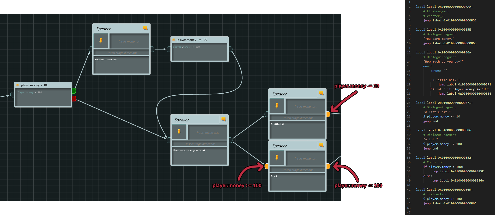
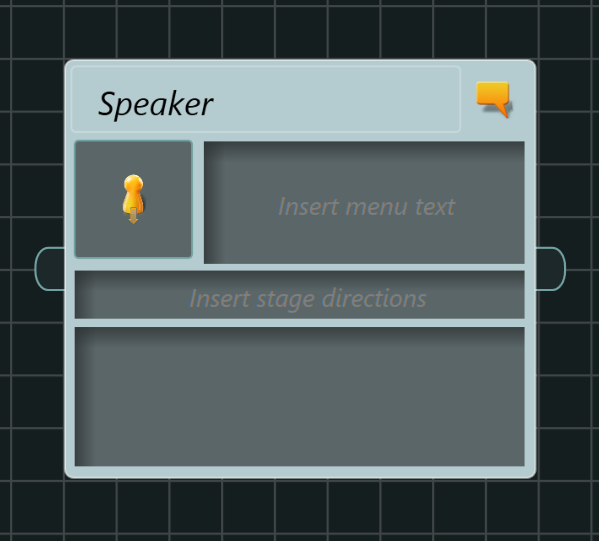

# articy3RenPy Code Generator

The **articy3RenPy Code Generator** is a script that converts the JSON export of a given articy-project to RenPy code. 
It is designed for those who want to develop their RenPy game with the help of articy:draft 3.

The goals of this Code Generator are:
 - Enabling the use of Articy's awesome story structuring capabilities. Visualising the flow of the game helps immensely if you want to create non-linear stories. Also, you can play through the text-based version of your game in Articy even before testing it in RenPy! 
 - Preventing redundancies. Don't use Articy to just plan out the flow of the game and then manually write RenPy code for it or you might run into consistency issues! If all the game logic is based on the Articy-project, then the code will always be consistent with it. 
 - Generating code that is easy to debug. The Code Generator does not create one big RenPy file with several thousands lines of code. Instead, it creates a hierarchy of directories that represents the story structure as given by the Articy-project. Also, a log file will give warnings in indicate precisely in which node they occured.

The Code Generator requires Python 3.9 or higher. As for RenPy, I have tested the Code Generator with RenPy 8.0.0. 
The generated code is pretty basic, I imagine it works with previous versions as well. 

## Table of Contents

 - [Showcase](#showcase)
   - [Menu with narration, dialogue and RenPy code](#menu-with-narration-dialogue-and-renpy-code)
   - [Conditions and instructions](#conditions-and-instructions)
   - [Articy entities to RenPy characters](#articy-entities-to-renpy-characters)
   - [Variables](#variables)
   - [Log file](#log-file)
 - [Quickstart](#quickstart)
 - [Setup Articy-Project](#setup-articy-project)
   - [Creating template for raw RenPy code](#creating-template-for-raw-renpy-code)
   - [(recommended) Create a single uppermost Flow Fragment](#recommended-create-a-single-uppermost-flow-fragment)
   - [(optional) Making it possible to pass parameters to Character objects](#optional-making-it-possible-to-pass-parameters-to-character-objects)
## Showcase

Here are some examples to give a short overview of the Code Generator's functionality. Open the images to see more details.

### Menu with narration, dialogue and RenPy code


Example menu with narration, dialogue and RenPy commands. The coloured highlights show where each part of the generated code comes from. The red box with the RenPy code is the custom ``RenPyBox`` template as defined in the [setup](#Creating-template-for-raw-RenPy-code).

### Conditions and instructions



Example with conditions and instructions. They can be set up with the ``Condition`` and ``Instruction`` nodes, or with the input and output pins of the nodes.

### Articy entities to RenPy characters


Example of Character objects being created from Articy entities. *Bob Baker* has the unchanged default ``Supporting characters`` template. *Alice Smith* and *Player Character* have the default ``Main Characters`` template extended with the custom ``RenPyCharacterParams`` feature as defined in the [setup](#-(optional)-Making-it-possible-to-pass-parameters-to-Character-objects).

### Variables


Example of Articy variables being set with their default values.

### Log file
```
game\chapter_1\articy_chapter_1.rpy
    label_0x01000000000007D0 references non-existent file "woof.mp3"
    label_0x01000000000007D0 contains the following line: # TODO: show the dog
game\chapter_2\articy_chapter_2.rpy
    label_0x01000000000007AA was not assigned any jump target in Articy, will jump to "end"
```

Example log file with three different types of log messages. 
The messages are grouped by the file they occured in.

## Quickstart

1. Edit ``config.ini``:
    1. Set "path_articy_json" to the path of the JSON export file of your Articy-project
    2. Set "path_target_dir" to the path of the dir that shall be created automatically and filled with the generated code. The directory must be inside the ``game`` folder of the RenPy game (it can also be in some subfolder in the hierarchy beneath ``game``, e.g. ``game/generated_files/articy``). 
2. Export your Articy-project as a JSON file to "path_articy_json". Make sure to export everything.
3. Execute ``python converter.py``. This will take the ``config.ini`` file in the same folder as the configuration for the generator. You can also give a path to an .ini-file as a command line argument: ``python converter.py path/to/config.ini``

| :exclamation:  If there already is a directory at "path_target_dir", its contents might be deleted! To prevent unintended deletions the script first checks if the files have the prefix specified in the .ini-file and if the subfolders have the expected names (names of the uppermost flow fragments in the Articy-project). The files and subfolders will only be deleted if both look like they were generated by previous iterations of the Code Generator. Otherwise an error will be thrown. |
|-----------------------------------------|

During the development of your game your Articy-project keeps changing. To update your RenPy code, just repeat the steps above. The Code Generator will automatically remove the old files in "path_target_dir" and fill it with new code generated from "path_articy_json". 

## Setup Articy-project

### Creating template for raw RenPy code

[RenPy's say-statement](https://www.renpy.org/doc/html/dialogue.html#say-statement) is the most common statement in RenPy syntax. That is why the Code Generator assumes by default that the text in Articy's Dialogue Fragments are say-statements. 

For all other RenPy statements, we need to tell the Code Generator that an Articy object contains raw RenPy code. That is done by defining a custom template in the Articy-project:

1. Go to Template Design>Templates>Dialogue Fragments
2. Create a new Template called ``RenPyBox`` (other names can be specified by changing the ``renpy_box`` parameter in the .ini-file)
3. Open the template. In the Template parameters tab you should see the ``Display name`` and the ``Technical name``. The value of the ``Technical name`` must be ``RenPyBox`` (or another name given in the .ini-file). If it is not, edit the template. 
4. (optional) Give the template a striking colour. That way you see at first glance which parts of your Articy-project contain raw RenPy code. 


Now you should be able to add nodes of the type ``RenPyBox`` to the flow. Go to Flow and click on the drop down menu to the right of the ``Dialogue Fragment`` button. You should see the templates based on ``Dialogue Fragment``, i.e. ``RenPyBox``. You can drag and drop it into the flow structure. 


### (recommended) Create a single uppermost Flow Fragment

The Code Generator needs to select some node in the Articy flow as the starting point for the generated code. It selects the first node it finds in the uppermost level of the flow hierarchy as the first element. To ensure that a predictable behaviour, I recommend a single Flow Fragment as the only element being the uppermost node. The name of the Flow Fragment can be chosen freely.


### (optional) Making it possible to pass parameters to Character objects

This Code Generator creates [RenPy Character](https://www.renpy.org/doc/html/dialogue.html#Character) objects for all entities in the Articy-project. By default the name of the Articy entity is given as the ``name`` parameter of the Character class. However, you may want to create Characters with other parameters. For that you need to create custom feature in your Articy-project with the parameters you want to pass and you need to assign that feature to the entities.

Create the custom feature:

1. Go to Template Design>Features
2. Create a new feature called ``RenPyCharacterParams`` (other names can be specified by changing the ``features_renpy_character_params`` parameter in the .ini-file)
3. Open the feature and then press Edit.
4. In the Feature parameters tab you should see the ``Display name`` and the ``Technical name``. The value of the ``Technical name`` must be ``RenPyCharacterParams`` (or another name given in the .ini-file). If it is not, edit the ``Technical name``.
5. Add a ``Text (small)`` property to the feature by dragging it into the empty field in the middle. It should have the title ``Text (small)`` and an empty text field below.
6. Click on the property. In the Property parameters tab you should see the ``Display name`` and  ``Technical name`` of the property. Name both of them like the parameter you want to pass to the RenPy Character class, for example ``name`` or ``who_color``.
7. Repeat steps 5 and 6 for as many parameters you want. 
8. Press Apply and confirm the changes.


Assign the feature to the entities that shall pass the parameters to RenPy's Character class:

1. Go to Template Design>Templates>Entities. 
2. Open an entity that shall pass parameters to RenPys Character class (e.g. ``Main characters``) and press Edit.
3. In the Features tab you should see the newly created feature (e.g. ``RenPyCharacterParams``). Drag and drop it into the field in the middle. 
4. Press Apply and confirm the changes. 


An entity of the type edited with the steps above (e.g. ``Main characters``) should now have the new feature. Open such an entity and go the Template tab, under ``RenPyCharacterParams`` you should see the properties you added to the feature. You can enter the parameters you want to pass by writing them into the text fields.


## Documentation

The Code Generator takes a config file, Articy's JSON Export and a path to a target directory for the generated code. 

### Structure

The target directory must be inside a RenPy project's game folder (e.g. ``game/articy`` or ``game/generated_code/articy``).
This directory should only contain code generated by this Code Generator. 
If the directory does not exist yet, it will be created. 
If there already is content in the target directory, the Code Generator checks if it might have been created by the Code Generator. 

That means the Code Generator checks if the files start with the ``file_prefix`` specified in the config file (default: "articy_"). 
It also checks whether the subfolders in the target dir are the names of the uppermost Flow Fragments in the Articy project (which should be only one if you [Create a single uppermost Flow Fragment](#recommended-create-a-single-uppermost-flow-fragment)). 
Assuming that file names are as specified in the config file, the target directory should contain no content other than:

 - ``articy_characters.rpy`` and ``articy_characters.rpyc`` (contains Character definitions)
 - ``articy_log.txt`` (contains log messages)
 - ``articy_start.rpy`` and ``articy_start.rpyc`` (contains the starting point for the generated code)
 - ``articy_variables.rpy`` and ``articy_variables.rpyc`` (contains variable initialisation)
 - subfolders for each of the uppermost FlowFragments in the Articy project. The folder names are in lowercase and spaces are replaced by underscores.
 
If all contents are as such, it is assumed that the contents of the target dir where generated by a previous iteration of the Code Generator. 
When generating code, the target dir first gets cleaned by automatically deleting these old files and folders and then creating the new contents. 
**The target directory should not contain anything other than automatically generated files and directories.** 
If there are different files or subfolders within the target directory, then the Code Generator will stop in order to prevent unintended deletions.

Each directory within the target dir represents an Articy FlowFragment or Dialogue node. 
The folder structure is like the Flow hierarchy in the Articy project. 
Every directory contains the file ``{file_prefix}{directory name}.rpy`` (+ maybe its corresponding .rpyc file). 
The .rpy file contains the RenPy code for that FlowFragment. 

Each node/model in the FlowFragment gets converted into block of RenPy code. 
The default label of a block is ``{label_prefix}{model ID}`` (``label_prefix`` default: "label_"). 
Should an error occur in a block, you can take the model ID from the label. 
Then you can find the erroneous node in Articy by searching by query with "Id=={model ID}". 
You can manually name a block with ``label="custom_label"`` in the stage directions of the Articy node.  

The ``articy_start.rpy`` file (may have different name depending on your config) contains the starting and end point of the generated code. 
The label of the starting point for the generated code is by default "start", i.e. the start of the RenPy game.
If you want to manually define the start block, you have to rename ``start_label`` in the config file.
The ``end_label`` defines the label of a block immediately ending the game, it's default value is "end".
All Articy generated blocks that don't have a target to jump to will jump to this block.

### Config file


The Code Generator can be configured with a .ini-file. 
If ``python converter.py`` is called without arguments, then the ``config.ini`` file will be used by default. 
Alternatively, a path to a .ini-file may be given as the first argument: ``python converter.py path/to/config.ini``. 
The key value pairs in the configuration file will be used as the parameters for the Code Generator. 
The configuration file does not need to specify all parameters, default values will be used if they are not set.

#### Paths

The only necessary parameters are the path parameters:

 - ``path_articy_dir``: The path to the JSON export of the Articy project.
 - ``path_target_dir``: The path that contain nothing but the generated contents. Must be in the hierarchy beneath the ``game`` directory of a RenPy project (e.g. ``game/articy`` or ``game/generated_files/articy``).

#### Files

The files parameters set the names of the generated files:

 - ``file_prefix``: The prefix given to all generated files. Default: ``_articy``
 - ``base_file_name``: Generated code base file. Contains the ``start_label`` and ``end_label`` blocks. Default: ``start.py``
 - ``variables_file_name``: File containing variable initialisations. Default: ``variables.rpy``
 - ``characters_file_name``: File containing Character definitions made from Articy's entities. Default: ``characters.rpy``
 - ``log_file_name``: File containing log messages, i.e. warnings. Default ``log.txt``

#### RenPy

The RenPy parameters control how the generated code will look like:

 - ``character_prefix``: The prefix given to the generated Character objects. Default: "character.", i.e. using [RenPy's character store](https://www.renpy.org/doc/html/dialogue.html#the-character-store).
 - ``label_prefix``: Prefix for the labels that can be jumped to. Default: ``label_``
 - ``start_label``: Label of the RenPy block at the start of the articy generated content. If "start", then it is also the start of the RenPy game. Default: ``start``
 - ``end_label``: Label of the RenPy block that ends the game. All Articy generated blocks that don't have a target to jump to will jump to this block, immediately ending the game. Default: ``end``
 - ``menu_display_text_box``: Whether to display the text box by default when showing menu choices (can be overwritten locally). Default: ``True``
 - ``markdown_text_styles``: Whether to parse simple markdown text styles by default (can be overwritten locally). Default: ``False``
 - ``relative_imgs_in_braces``: Whether to parse image names in braces to specific image paths (can be overwritten locally). Default: ``False``
 - ``beginnings_log_lines``: Beginnings of RenPy code lines that shall be logged. Default: ``# todo, #todo``

#### Articy

The Articy parameters define the names of special Articy objects the Code Generator shall pay attention to:

 - ``features_renpy_character_params``: Technical names of features that contain parameters for RenPy Character objects, see [here](#optional-making-it-possible-to-pass-parameters-to-character-objects) for how to create and assign them. Default: ``RenPyCharacterParams``
 - ``renpy_box``: Name of the template that indicates a block with RenPy-code, see [here](#creating-template-for-raw-renpy-code) for how to create them. Default: ``RenPyBox``

### Dialogue Fragment



The Dialogue Fragment is used for narration and dialogue. 
It contains the following four parts: 

 - Speaker
 - Text
 - Menu Text
 - Stage Directions

#### Speaker

An entity that speaks the lines written in the fragment. 
If no entity is given, then the line will not be assigned a Character object. 
However, you can still apply a speaker string via the ``speaker`` stage direction, e.g. ``speaker="John Smith"``. 
If both an entity and the ``speaker`` stage direction are given, then the ``speaker`` string will be used for the line(s). 

#### Text

The big field at the bottom is the text that will be spoken/narrated. 
Can be multiple lines. 
The markdown text styles commands \*italics\*, \*\*bold\*\* and \_underlined\_ may be parsed. 
To enable the parsing, set ``markdown_text_styles`` in the config file to "True". 
Alternatively, markdown parsing may be enabled or disabled for a single Dialoge Fragment via the ``markdown`` stage direction, e.g. ``markdown=True``. 

#### Menu Text

If a node in Articy has multiple outgoing connections, then a RenPy menu will be created with a text for each choice. 

The choice text for a Dialogue Fragment will set as following:
 1. Menu Text of the Dialogue Fragment, if it set
 2. Label of the connection towards the Dialogue Fragment, if it is set
 3. Text of the Dialogue Fragment, if it is set

If there is no choice text, an error will be thrown. 
Markdown parsing may be enabled like in Text.

#### Stage Directions

With the stage directions the Code Generator can deviate from its default behaviour. 
Multiple comma separated arguments can be given, leading and trailing spaces get ignored. 
All stage directions are optional.
The instructions will be applied to all lines. 

 - ``choice_index``: Determines the order in which Dialogue Fragments (including those with the template ``RenPyBox``) get displayed in a RenPy menu. A node with smaller choice_index gets displayed first. The choice_index is given as a sole integer, e.g.: ``2``.
 - ``speaker``: String that will be used as the speaker. Will be used instead of entity if both were given. Example usage: ``speaker="John Smith"`` for ``"John Smith" "No entity was assigned to this Dialogue Fragment"``
 - ``markdown``: Whether or not to do simple markdown text style parsing. Will overwrite the default ``markdown_text_styles`` in the config file. Note that the parsing is very basic, complex combinations may not work. Example usage: ``markdown=True``
 - ``before``: String of an instruction that shall be inserted before the text. If set, a space will be inserted between ``before`` and the text. Example usage: ``before="@ angry"`` for ``character.alice @ angry "I am angry!"`` 
 - ``after``: String of an instruction that shall be inserted after the text. If set, a space will be inserted between the text and ``after``. Example usage: ``after="with vpunch"`` for ``character.alice "I am angry!" with vpunch``
 - ``display_text_box``: Whether or not to display the last line of dialogue/narration when showing menu choices. Will overwrite the default ``menu_display_text_box`` in the config file Example usage: ``dispaly_text_box=True``
 - ``label``: String of the label the Dialogue Fragment should have. The ``label_prefix`` will not be prepended. Example usage: ``label="custom_label"``

### RenPyBox


The ``RenPyBox`` (or another name you chose for ``renpy_box`` in the config file) is used to generate RenPy code that is not narration or dialogue. 

As it is based on the Dialogue Fragment it has the same four parts:

 - Speaker
 - Text
 - Menu Text
 - Stage Directions

#### Speaker

Only relevant if Menu Text is used. 

An entity that speaks the lines written in the fragment. 
If no entity is given, then the line will not be assigned a Character object. 
However, you can still apply a speaker string via the ``speaker`` stage direction, e.g. ``speaker="John Smith"``. 
If both an entity and the ``speaker`` stage direction are given, then the ``speaker`` string will be used for the line(s). 

#### Text

The Code Generator will print these lines unmodified, so they can contain any RenPy code. 
Text can be multiple lines of code. 
If a line starts with one of ``beginnings_log_lines``, then the line will be logged. 
By default the Code Generator will log lines if they begin with "# todo" or "#todo". 

The Code Generator will also log lines if they contain a reference to an image or audio file and do not find it in the ``images`` and ``audio`` directories, respectively. 
Something is considered to be a file reference if it is encapsulated by quotes and ends with an image or audio file ending (".png", ".jpg", ".jpeg", ".webp", ".gif" and ".mp3", ".wav", ".ogg", ".opus", ".flac" respectively). 

The Code Generator has the option to parse image names to paths if they are written in curly braces. 
Let's say we have got an Articy flow hierarchy ``game>chapter_19>scene_04`` and in that ``scene_04`` Flow Fragment there is a ``RenPyBox`` with "{img_11.png}" in its Text. 
Then the Code Generator can parse this to "images/game/chapter_19/scene_04/img_11.png". 
As this is a rather special case, this behaviour is disabled by default. 
You can enable it in the config file with ``relative_imgs_in_braces=True``. 
Alternatively you can enable or disable it for a single ``RenPyBox`` with the stage directions ``relative_img=True`` and ``relative_img=False``.

As for my motivation why I created this feature: I had many unique images that I wanted to give meaningful names (image name should describe what is in it). 
But I also wanted the name to be short, i.e. rather just "pc_cheering.png" instead of "chapter_19_scene_04_img_11_pc_cheering.png". 
That is why I created the same directory system in the RenPy project's ``game/images`` folder as the flow hierarchy in the Articy project. 
That is, if I had the flow hierarchy ``game/chapter_19/scene_04`` in Articy, then I also made the directory ``game/images/game/chapter_19/scene_04`` in RenPy (manually). 
Now I did not want to refer to each image with its full path name, if I could infer the path based on the Flow Fragment it occurs in.
That is why I added the functionality to parse image names in braces. 

#### Menu Text

If a node in Articy has multiple outgoing connections, then a RenPy menu will be created with a text for each choice. 

The choice text for a ``RenPyBox`` will set as following:
 1. Menu Text of the ``RenPyBox``, if it set
 2. Label of the connection towards the ``RenPyBox``, if it is set
 3. Text of the ``RenPyBox``, if it is set (note that this would be raw RenPy code!)

If there is no choice text, an error will be thrown. 
Markdown parsing may be enabled like in Text.

Also, ``RenPyBox``'s Menu Text can be repeated after executing the contents of the Text field. 
The Menu Text would appear as narration/dialogue, i.e. same as the Text field of a Dialogue Fragment. 
I found this to be very useful for menus: 
The displayed choices were things the player character could say. 
After clicking on a choice, the RenPy code in the Text field executes immediately (e.g. showing an image of the player character speaking) and then the Menu Text repeats. 
This can be enabled in the config file with ``repeat_menu_text=True``. 
Alternatively you can enable or disable it for a single ``RenPyBox`` with the stage directions ``repeat_menu_text=True`` and ``repeat_menu_text=False``. 

In the picture below the config's ``repeat_menu_text`` has been set to ``True``. 
The example also demonstrates the ``choice_index`` setting the order of the choices.


### Stage Directions

A ``RenPyBox`` can take the same instructions as a Dialogue Fragment, plus some additional ones (``relative_img``, ``repeat_menu_text``). 
Multiple comma separated arguments can be given, leading and trailing spaces get ignored. 
All stage directions are optional.
The instructions will be applied to all lines. 

 - ``choice_index``: Determines the order in which Dialogue Fragments (including those with template ``RenPyBox``) get displayed in a RenPy menu. A node with smaller choice_index gets displayed first. The choice_index is given as a sole integer, e.g.: ``2``.
 - ``speaker``: String that will be used as the speaker. Will be used instead of entity if both were given. Example usage: ``speaker="John Smith"`` for ``"John Smith" "No entity was assigned to this RenPyBox"``
 - ``markdown``: Whether or not to do simple markdown text style parsing. Will overwrite the default ``markdown_text_styles`` in the config file. Note that the parsing is very basic, complex combinations may not work. Example usage: ``markdown=True``
 - ``before``: String of an instruction that shall be inserted before the text. If set, a space will be inserted between ``before`` and the text. Example usage: ``before="@ angry"`` for ``character.alice @ angry "I am angry!"`` 
 - ``after``: String of an instruction that shall be inserted after the text. If set, a space will be inserted between the text and ``after``. Example usage: ``after="with vpunch"`` for ``character.alice "I am angry!" with vpunch``
 - ``display_text_box``: Whether or not to display the last line of dialogue/narration when showing menu choices. Will overwrite the default ``menu_display_text_box`` in the config file Example usage: ``display_text_box=True``
 - ``label``: String of the label the ``RenPyBox`` should have. The ``label_prefix`` will not be prepended. Example usage: ``label="custom_label"``
 - ``relative_img``: Whether to convert image names in braces to paths to images. Example usage: ``relative_img=True``
 - ``repeat_menu_text``: Whether to repeat Menu Text after executing the contents of the Text field. Example usage: ``repeat_menu_text=False``
